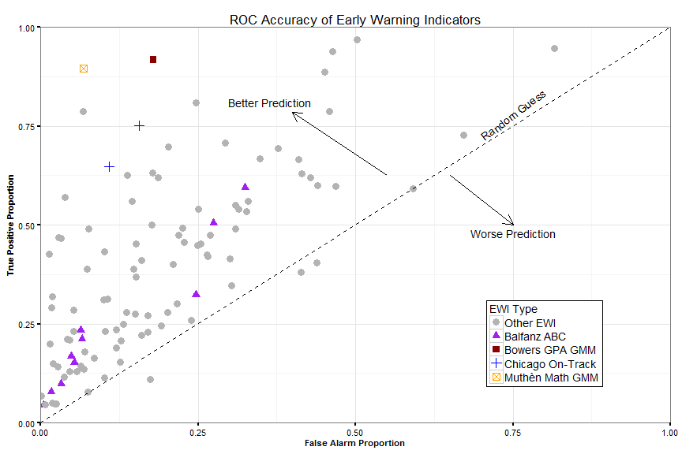

---
title: "Data Visualization"
author: "Jared E. Knowles"
date: "February 25, 2016"
output: 
  ioslides_presentation:
    css: custom.css
    widescreen: TRUE
runtime: shiny
---

<style>
div#before-column p.forceBreak {
    break-before: column;
}
div#after-column p.forceBreak {
    break-after: column;
}
</style>

```{r setup, include=FALSE}
library(shiny)
library(knitr)
knitr::opts_chunk$set(echo = FALSE, warning = FALSE, message = FALSE, fig.align = "center")
library(ggplot2)
library(scales)
```

## Data Visualization

- Data use is increasingly popular in many areas (including education)
- Policymakers are under increasing pressure to use data to inform decisions, 
justify funding, and guide practice
- **But,** policymakers are often **not** statisticians, researchers, or quants
- **Data visualization** is a way to bridge this gap
- Proper data visualization will bring the data to the audience in a way they can understand quickly and use to inform decisions

## A Definition

<p><q>Data visualization is a tool for communicating <span class = 'red'>a 
specific feature</span> of a dataset in an approachable and efficient manner</q></p>


## The Challenge

- Data visualization is a communication tool -- like writing
- Like writing, data visualization is very **audience dependent**
- Like writing, data visualization has **different purposes**
- Like writing, data visualization has **varying styles**
- Like writing, data visualization is **shaped by context and technology**

## Think about writing
- What are some different ways you use writing in your day to day life?

>- Note taking
>- Explanation
>- Sharing
>- Thinking
>- Persuading

<p><q>If a picture is worth a thousand words, a good data visualization must 
always be <span class = 'red'>better than a table.</span></q></p>


## Objectives

1. Deconstruct the components of data visualization
2. Apply this to a complex data visualization
3. Review data visualization examples
4. Discuss the role of context
5. Using Visualization


## Deconstructing a graphic

```{r}
data(tips, package = "reshape2")

ggplot(tips, aes(x = total_bill, y = tip, color = time)) + 
  geom_point() + geom_smooth(aes(group = 1), se = FALSE, 
                             show.legend = FALSE) + 
  scale_color_brewer(type = "qual", palette = 2) + 
  labs(x="Total Bill ($)", y="Tip ($)", 
       title="Restaurant Tipping Patterns", color = "Meal") + 
  scale_y_continuous(label = dollar) + scale_x_continuous(label = dollar) +
  theme_classic(base_size = 16)

```


## Elements {.columns-2}

- Aesthetics
- Geometry
- Guides
- Scales
- Labels
- Layers

```{r plot1,out.width="450px",out.height="360px",echo=FALSE}
ggplot(tips, aes(x = total_bill, y = tip, color = time)) + 
  geom_point() + geom_smooth(aes(group = 1), se = FALSE, 
                             show.legend = FALSE) + 
  scale_color_brewer(type = "qual", palette = 2) + 
  labs(x="Total Bill ($)", y="Tip ($)", 
       title="Restaurant Tipping Patterns", color = "Meal") + 
  scale_y_continuous(label = dollar) + scale_x_continuous(label = dollar) +
  theme_classic(base_size = 16)
```


## Aesthetics

Aesthetics are the visual elements we use to encode data onto a plot. Examples 
include: 

- Location (x and y coordinates)
- Color and Fill
- Size and Shape
- Alpha / transparency

## Experiment with Aesthetics

```{r aesthetics}
inputPanel(
  selectInput("x", label = "X axis:",
      choices = c("total_bill", "tip", "sex", "smoker", 
                  "day", "time", "size"), selected = "total_bill"),
  selectInput("y", label = "Y axis:",
      choices = c("total_bill", "tip", "sex", "smoker", 
                  "day", "time", "size"), selected = "tip"),
  selectInput("color", label = "Color:",
      choices = c("total_bill", "tip", "sex", "smoker", 
                  "day", "time", "size"), selected = "sex")
)

renderPlot({
  ggplot(tips, aes_string(x = input$x, y = input$y, color = input$color)) + 
  geom_point() +
  scale_color_brewer(type = "qual", palette = 2) + 
  labs(title="Restaurant Tipping Patterns") + 
  theme_classic(base_size = 16)
})
```

## Geometries

Geometries are visual elements themselves -- objects that are placed on the canvas

- point
- line
- polygon
- boxplot
- text

When you think of differences in chart types (bar, pie, etc.) you are most often 
thinking of different ways they arrange geometries. 

## Experiment with Geometries


```{r geometries}

shinyApp(
   ui = fluidPage(
  sidebarLayout(
    sidebarPanel(
  selectInput("x", label = "X axis:",
      choices = c("total_bill", "tip", "sex", "smoker", 
                  "day", "time", "size"), selected = "total_bill"),
  selectInput("y", label = "Y axis:",
      choices = c("total_bill", "tip", "sex", "smoker", 
                  "day", "time", "size"), selected = "tip"),
  selectInput("color", label = "Color:",
      choices = c("total_bill", "tip", "sex", "smoker", 
                  "day", "time", "size"), selected = "sex"), 
  selectInput("geom", label = "Geometry:",
      choices = c("point", "text", "bar", "line", "smoother",
                  "boxplot", "contour", "bin", "violin"), selected = "point"), 
  width = 2), 
    mainPanel(plotOutput("geomPlot")
    )
  )),
  
  server = function(input, output) {
    p1 <- reactive({
     ggplot(tips, aes_string(x = input$x, y = input$y, 
                               color = input$color, group = input$color, 
                               fill = input$color)) + 
  scale_color_brewer(type = "qual", palette = 2) + 
  labs(title="Restaurant Tipping Patterns") + 
  theme_classic(base_size = 16)
  })
  output$geomPlot <- renderPlot({
 if(input$geom == "point"){
   p1() + geom_point()
 } else if(input$geom == "text"){
   p1() + geom_text(aes_string(label = input$color))
 } else if(input$geom == "bar"){
   p1() + geom_bar(stat = "identity")
 } else if(input$geom == "line"){
  p1() + geom_line() 
 } else if(input$geom == "smoother"){
   p1() + geom_smooth()
 } else if(input$geom == "boxplot"){
   p1() + geom_boxplot()
 } else if(input$geom == "contour"){
   p1() + geom_density_2d()
 } else if(input$geom == "bin"){
   p1() + geom_bin2d()
 } else if(input$geom == "violin"){
   p1() + geom_violin()
 }}, width=600 , height=500)
    })


```


## Guides

A guide is an element that helps the user map visual cues to data points. Legends 
are the most common type of guide. 

- Axes
- Reference lines
- Color bars
- Annotations

## Experiment with Guides

```{r guides}
shinyApp(
   ui = fluidPage(
  sidebarLayout(
    sidebarPanel(
  selectInput("x", label = "X axis:",
      choices = c("total_bill", "tip", "size"), selected = "total_bill"),
  selectInput("y", label = "Y axis:",
      choices = c("total_bill", "tip", "size"), selected = "tip"),
  selectInput("guide", label = "Guides:",
      choices = c("axes", "ref. lines", "annotate", "color bar"), 
      selected = "color bar"), 
  width = 2), 
    mainPanel(plotOutput("guidePlot")
    )
  )),
  
  server = function(input, output) {
    p1 <- reactive({
     ggplot(tips, aes_string(x = input$x, y = input$y, 
                               color = "size", 
                               fill = "size")) + 
  geom_point() + guides(color = "none", fill = "none") +
  labs(title="Restaurant Tipping Patterns") + 
  theme_bw(base_size = 16)
  })
  output$guidePlot <- renderPlot({
 if(input$guide == "axes"){
   p1() + theme(axis.line = element_blank(),
                  axis.text = element_blank(), axis.ticks = element_blank()) + 
     theme_bw(base_size = 16)
 } else if(input$guide == "ref. lines"){
   p1() + 
     theme(panel.grid = element_line(color = "gray50", size = 0.5, linetype = 3),
           panel.grid.major = element_line(), panel.grid.minor = element_line()) + 
     geom_abline(intercept = 0, slope = 0.15, linetype = 2)
 } else if(input$guide == "annotate"){
   p1() + annotate("text", x = 7, y = 7, label = "Annotation") + 
     annotate("text", x = 7, y = 4, label = "Look here!")
 } else if(input$guide == "color bar"){
  p1() + guides(color = guide_colorbar())
 }}, width=600 , height=500)
    })


```


## Scales

Scales are mathematical transformations of the mapping between data elements and 
aesthetics

- Axis breaks
- Color mapping to data elements
- Transformations like log, square root, etc.

## Experiment with Scales

```{r scales}
shinyApp(
   ui = fluidPage(
  sidebarLayout(
    sidebarPanel(
  selectInput("scale", label = "Scale:",
      choices = c("normal", "breaks", "color-1", "color-2", "sqrt-trans", 
                  "log-trans", "percentage"), 
      selected = "normal"), 
  width = 2), 
    mainPanel(plotOutput("scalePlot")
    )
  )),
  
  server = function(input, output) {
    p1 <- reactive({
     ggplot(tips, aes_string(x = "total_bill", y = "tip", 
                                color = "size", 
                                fill = "size")) + 
  geom_point() + guides(color = "none", fill = "none") +
  labs(title="Restaurant Tipping Patterns", x= "Total Bill", y = "Tip") +
  scale_y_continuous(label = dollar) + scale_x_continuous(label = dollar) +
  theme_classic(base_size = 16)
  })
  output$scalePlot <- renderPlot({
 if(input$scale == "breaks"){
   p1() + scale_y_continuous(breaks = c(1, 5, 12, 25), 
                             label = dollar, limits = c(0, 50)) + 
     scale_x_continuous(breaks = c(0, 30, 32, 36, 42, 48), label = dollar, 
                        limits = c(0, 50))
 } else if(input$scale == "normal"){
   p1() 
 } else if(input$scale == "color-1"){
   p1() + guides(color = guide_colorbar())
 } else if(input$scale == "color-2"){
  p1() + scale_color_gradient(low = "skyblue", high = "dark green") + 
     guides(color = guide_colorbar())
 } else if(input$scale == "sqrt-trans"){
   p1() + scale_y_sqrt(label = dollar) + scale_x_sqrt(label = dollar)
 } else if(input$scale == "log-trans"){
   p1() + scale_y_log10(label = dollar) + scale_x_log10(label = dollar)
 } else if(input$scale == "percentage"){
   tips$tipPer <- tips$tip / tips$total_bill
   ggplot(tips, aes_string(x = "total_bill", y = "tipPer", 
                                color = "size", 
                                fill = "size")) + 
  geom_point() + guides(color = "none", fill = "none") +
  labs(title="Restaurant Tipping Patterns", x= "Total Bill", y = "Tip") +
  scale_y_continuous(label = percent) + scale_x_continuous(label = dollar) +
  theme_classic()
 }
    }, width=600 , height=500)
    })


```


## Labels

Labels are additional information that does not directly come from the data 
that helps the user interpret the graph. 

- Titles
- Axis labels
- Legend titles
- Units labels

## Layers

Layers are how all of these elements are pulled together. 

A layer consists of:

  1. data, 
  2. a mapping of aesthetics to that data, 
  3. a geometry to place that data on the canvas, 
  4. and additional parameters to control the scales, labels, and guides. 


## Assembling a Graphic {.columns-2}

- SCALE: Y (0 - 10), label dollar, data = Tip
- SCALE: X (0 - 50), label dollar, data = Total Bill
- SCALE: Color (Teal = Dinner, Orange = Lunch), data = Meal
- GEOM: Point (x = Total Bill, y = Tip, color = MEAL)
- GEOM: Line (x = Total Bill, y = Tip)


```{r plotHalf, out.width="500px",out.height="360px",echo=FALSE}
ggplot(tips, aes(x = total_bill, y = tip, color = time)) + 
  geom_point() + geom_smooth(aes(group = 1), se = FALSE, 
                             show.legend = FALSE) + 
  scale_color_brewer(type = "qual", palette = 2) + 
  labs(x="Total Bill ($)", y="Tip ($)", 
       title="Restaurant Tipping Patterns", color = "Meal") + 
  scale_y_continuous(label = dollar) + scale_x_continuous(label = dollar) +
  theme_classic(base_size = 16)
```


## Leveraging Visualization Skills

1. Using data to visualize and not storytell
2. Review persuasive techniques
3. Discuss role of visualization
4. Closing an argument

## Why focus on persuasion?

- Most data presentations seek to make some sort of an argument
- Goal is to convince someone to make a decision or to understand a problem 
that requires their attention
- The evidence provided is in the form of data
- But the goal is to spur some action (concern, policy change, attention shift, etc.)

## Why not storytelling?

- Storytelling allows the construction of a compelling narrative, but data, 
evidence, and facts are not necessary
- Storytelling invites alternative explanations with no way to equate them
- Storytelling implies an ending/resolution and does not require the audience to 
contribute
- Audiences can choose to ignore, dislike, disregard stories

## How is persuasion different?

An argument has three classic components:

1. A claim
2. Evidence
3. A warrant

This can be extended by explicitly anticipating and rebutting counter claims:

4. Acknowledge counterclaim
5. Offer rebuttal (1-3)

## Types of Claims

- Claims of fact
- Claims of value
- Claims of policy

## Types of evidence

- Sufficient and appropriate data
- Credibility and reputation
- Appeal to authority

## Logic and causality

- Sequencing
- Discussion of plausible mediators
- Rejection of counter-claims

## Policy claims

- Require a mix of both fact and values
  - "Does this outcome fit with our values as an organization?"
- Need to directly address trade offs of alternatives, most importantly status 
quo

## Warrants

Warrants are assumptions that underpin the evidence. This is especially crucial 
in using data as evidence. 

- Do you have a shared understanding of the meaning of the data elements?
- Is there shared trust about the validity/accuracy of the measures?
- Are the definitions embodied in the data meaningful and shared?

The key here is to know your audience.


## Why Opinions Change (Pandey et al, 2014)

1. *Struck by evidence*
2. Evidence strengthens existing views
3. *Boomerang* -- when your argument is weak

## Why Opinions Don't Change (Pandey et al, 2014)

1. Sketpical of Data
2. Skeptical of Logic
3. Core Beliefs
4. Complexity


## Persuasion

1. Ethos
2. Pathos
3. Visualization

## Lessons Learned

1. Ethos: Build trust in the data.
2. Ethos: Build trust in the framing.
3. Pathos: Be mindful of values and address core shared values.
4. Visualization: Clarity and drama

### Empower Your Audience to Take Action

## Colors, Order, and Presentation

The way to achieve this goal is by using every visual element to your advantage. 
Colors, shapes (geometries), scales, and labels should all be harnessed in 
service of your message.

## Order

Which tells a better story?

```{r, fig.align = 'center'}
plotdf <- data.frame(y = runif(26), x = LETTERS)

ggplot(plotdf, aes(x = x, y = y)) + geom_bar(stat = 'identity') + 
  scale_y_continuous(label = percent) + theme_classic(base_size = 16)

```

## Order 

```{r, fig.align = 'center'}
ggplot(plotdf, aes(x = reorder(x, y), y = y)) + geom_bar(stat = 'identity') + 
  scale_y_continuous(label = percent) + theme_classic(base_size = 16)

```

## Annotation and Scale


```{r, fig.align = 'center'}
ggplot(plotdf, aes(x = reorder(x, y), y = y)) + geom_bar(stat = 'identity') + 
  scale_y_continuous(label = percent) + theme_classic(base_size = 16) + 
  geom_hline(yintercept = 0.7) + 
  annotate(geom = "text", x = 5, y = 0.75, label = "Performance benchmark")

```


## Why make it hard?

```{r, fig.align = 'center'}
plotdf$col <- ifelse(plotdf$y >= 0.7, "Meet", "Miss")

ggplot(plotdf, aes(x = reorder(x, y), y = y, fill = col)) + geom_bar(stat = 'identity') + 
  scale_y_continuous(label = percent) + theme_classic(base_size = 16) + 
  scale_fill_brewer(type = "qual", palette = 2) + 
  geom_hline(yintercept = 0.7) + 
  annotate(geom = "text", x = 5, y = 0.75, label = "Performance benchmark")

```


## Invite exploration

```{r, fig.align = 'center'}
ggplot(plotdf, aes(x = reorder(x, y), y = y, fill = col)) + geom_bar(stat = 'identity') + 
  scale_y_continuous(label = percent) + theme_classic(base_size = 16) + 
  scale_fill_brewer("Benchmark", type = "qual", palette = 2) + 
  geom_hline(yintercept = 0.7) + 
  geom_text(label = paste0(round(plotdf$y*100, 0), "%"), size = 4, vjust = -1) +
  annotate(geom = "text", x = 5, y = 0.75, label = "Performance benchmark") + 
  coord_cartesian(ylim = c(0, 1), expand = FALSE)

```

## Make drama clear

```{r}
set.seed(1245)
plotdf <- data.frame(x1 = runif(100), x2 = runif(100), x3 = runif(100), epsilon = runif(100))
plotdf$y <- 1 + 2*plotdf$x1 + -1*plotdf$x2 + 1.2*plotdf$x3^2 + plotdf$epsilon

tmp <- data.frame(x1 = c(0.2, 0.1, 0.9), x2 = c(0, 0, 0), x3 = c(0, 0, 0), 
                  epsilon = c(2.9, 1.89, -2.25))
tmp$y <- 1 + 2*tmp$x1 + -1*tmp$x2 + 3*tmp$x3^2 + tmp$epsilon
plotdf <- rbind(plotdf, tmp)
plotdf$outlier <- c(rep("No", 100), rep("Yes", 3))


ggplot(plotdf, aes(x = x1, y = y, color = outlier, shape = outlier)) + 
  geom_point() +  
  theme_bw() + scale_color_brewer(type = "qual", palette = 6) + 
  geom_smooth(aes(group = 1)) + 
  annotate("rect", xmin = 0.05, xmax = 0.25,  ymin = 3, ymax = 4.5, alpha = .2) +
  annotate("rect", xmin = 0.85, xmax = 1,  ymin = 0, ymax = 1, alpha = .2) 


```


## Use only these color schemes (divergent)

```{r, echo = FALSE, fig.align='center', fig.height=10, fig.width=16, fig.retina=TRUE}
library(RColorBrewer)
display.brewer.all(type = 'div')
```

## Use only these color schemes (qualitative)

```{r, echo = FALSE, fig.align='center', fig.height=10, fig.width=16, fig.retina=TRUE}
display.brewer.all(type = 'qual')
```

## Use only these color schemes (sequential)

```{r, echo = FALSE, fig.align='center', fig.height=10, fig.width=16, fig.retina=TRUE}
display.brewer.all(type = 'seq')
```

## More complex graphics

We use the same principles, but in layers, and to invite more engagement.

## Maps


## Comparing Model Performance

<p align="center"></p>

## Animation Example

<p align="center"></p>

## Why does this work?

- Annotation
- Labeling
- Lots of data-ink
- Reference points galore

## Some tips

- Have a properly chosen format and design 
- Use words, numbers and drawing together
- Reflect a balance, a proportion, relevant scale
- Display an accessible complexity of details
- Have a narrative quality, tell a story
- Avoid content-free decoration (Tufte's proverbial chartjunk)
- Draw in a professional manner with an eye on the technical details
- Provide your audience with the context they need and remember they haven't 
lived in the data like you!

## Themes

```{r plot2, echo=FALSE}
library(gridExtra)
library(ggthemes)
p1 <- qplot(hp, mpg, data=mtcars) + theme_economist()
p2 <- qplot(hp, mpg, data=mtcars) +  theme_tufte()
p3 <- qplot(hp, mpg, data=mtcars, color=factor(cyl)) + 
  theme_excel() + scale_color_excel()
p4 <- qplot(hp,mpg,data=mtcars,color=factor(cyl)) + theme_stata()

grid.arrange(p1, p2, p3, p4, ncol = 2, nrow = 2)
```

## Technical Details 

<p><q>Don't forget them.</q></p>

## Graphics Files {.columns-2}

### Raster

- Files like **jpg** , **png** , **gif**. 
- Fixed scale, aspect ratio, and size
- Reasonable file size
- Viewable in almost any image viewing and editing system, including any modern web browser, PowerPoint, etc.

### Vector

- Files like **pdf** and **svg**
- Infinitely zoomable, adjustable on the fly
- Larger file size
- Viewable and usable in fewer systems. SVGs can be used in modern web browsers. PDFs included in other PDF reports. 

## Programming vs. Illustrating

Keep in mind that depending on the project you may need to programatically make 
data visualizations, or you may need a highly customized illustrated graphic. 

## Technologies

The technology you choose to do visualizations is largely a question of personal productivity, but with some important caveats:

- In the future, more and more content is going to be delivered in a paperless world, so pick a technology that can leverage web/tablet/phone interfaces
- Different technologies are useful for different levels of finish and polish; Adobe Illustrator is great for publication quality graphics, R is a great tool for rapidly prototyping different visualizations
- Chose a technology that best serves your **consumer**, not you the producer. Charts are a service to the consumer, not to the creator. 

## Some Opinions on Technologies

```{r technologies,echo=FALSE}
techs<-c("Adobe", "R", "Stata/SPSS", "D3", "Tableau", "JavaScript", 
         "Processing", "Excel", "SAS")
speed  <- c(1.5, 7, 5, 6, 9, 4, 5, 9, 4)
quality <- c(10, 9, 5, 9, 8, 8, 9, 2, 4)
web <- c("Yes", "Yes", "No", "Yes", "No", "Yes", "Yes", "No", "No")
viz <- data.frame(techs=techs, speed=speed, quality=quality, web=web)

qplot(speed, quality, data=viz, geom="point", color=factor(web), size = I(4)) + 
  coord_cartesian(x = c(0,11), y = c(0,11)) + theme_bw() +
  geom_text(aes(label = techs), color="black", vjust=1.4, hjust=1, size = I(4)) +
  theme(axis.text=element_blank(), axis.ticks=element_blank(), 
        legend.position = c(0.185, 0.1), legend.direction ="horizontal") +
  labs(color="Web Ready") + 
  scale_color_few() +
  labs(x = "Speed", y = "Quality") 
```


## Beyond Graphics

We have a number of other techniques we can use beyond simple charts. 

- Animations
- Interactive demos
- Summary tables
- Videos
- Web sites
- Simulations

## References

- Tufte, Edward. 1992. [The Visual Display of Quantitative Information.](http://www.amazon.com/The-Visual-Display-Quantitative-Information/dp/0961392142/) Graphics Press. 
- Unwin, Theus, and Hofmann. 2006. [Graphics of Large Datasets: Visualizing a Million.](http://www.amazon.com/Graphics-Large-Datasets-Visualizing-Statistics/dp/0387329064) Springer. 
- Wilkinson, Leland. 2005. The Grammar of Graphics. Springer.
- Ware, Colin. 2012. [Information Visualization: Perception for Design.](http://www.amazon.com/Information-Visualization-Third-Edition-Technologies/dp/0123814642/ref=reg_hu-rd_add_1_dp) 3rd Edition. Morgan Kaufmann. 
- Cleveland, William. 1994. [The Elements of Graphing Data.](http://www.amazon.com/gp/product/0963488414/) Hobart Press. 
- Cleveland, William. 1993. [Visualizing Data.](http://www.amazon.com/gp/product/0963488406) Hobart Press.

## References (cont'd)

- Few, Stephen. 2009. [Now You See It: Simple Visualization Techniques for Quantiative Analysis.](http://www.amazon.com/gp/product/0970601980/) Analytics Press. 
- Few, Stephen. 2012. [Show Me the Numbers: Designing Tables and Graphs to Enlighten.](http://www.amazon.com/gp/product/0970601972) Analytics Press. 
- Yau, Nathan. 2011. [Visualize This: The FlowingData Guide to Design, Visualization, and Statistics.](http://www.amazon.com/Visualize-This-FlowingData-Visualization-Statistics/dp/0470944889/) Wiley.
- Few, Stephen. 2006. [Information Dashboard Design: The Effective Visual Communication of Data.](http://www.amazon.com/Information-Dashboard-Design-Effective-Communication/dp/0596100167) O'Reilly Media

## Where to Learn Online?

- [Andy Kirk](http://www.visualisingdata.com)
- [D3](http://d3js.org/)
- [The Functional Art](http://www.thefunctionalart.com/)
- [ggplot2](http://www.ggplot2.org)
- [Robert Kosara](http://eagereyes.org/about)
- [Data Stories Podcast](http://datastori.es/)
- [Rad Presenters Podcast](http://www.radpresenters.com/)

## Contact Information

- E-mail: jared.knowles@dpi.wi.gov / jknowles@gmail.com
- GitHub: [http://www.github.com/jknowles](http://www.github.com/jknowles)
- Homepage: [www.jaredknowles.com](http://www.jaredknowles.com/)
- Google+: [https://plus.google.com/+JaredKnowles](https://plus.google.com/+JaredKnowles)

## More stuff
 
3. Review data visualization examples
4. Discuss the role of context
5. Leveraging Visualization
